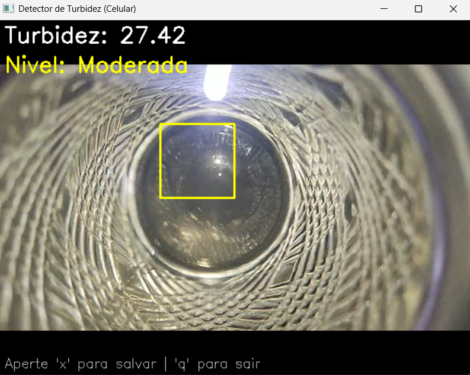

# Detector-de-Turbidez

💧 Detector de Turbidez com Visão Computacional

Este é um projeto simples e funcional de detecção de turbidez em água utilizando Python, OpenCV e a câmera de um celular como fonte de vídeo. O sistema mede a turbidez com base na variação de intensidade dos pixels em uma região da imagem (desvio padrão), podendo classificar a amostra como:

🟢 Baixa

🟡 Moderada

🔴 Alta

📷 Exemplo de Funcionamento




### ⚙️ Como Funciona

- A câmera (por exemplo, usando o app **Iriun Webcam**) captura o vídeo em tempo real.  
- Uma **área de detecção (ROI)** é definida no centro da tela.  
- A **turbidez é calculada** com base no desvio padrão dos tons de cinza da região capturada.  
- O **nível é classificado automaticamente** com base em faixas predefinidas.  
- O usuário pode **capturar uma imagem** com a turbidez medida pressionando a tecla `x`.

---

### 🧠 Lógica de Classificação

- **Desvio Padrão (`np.std`)**:
  - `< 10` → **Baixa** → 🟢 Verde  
  - `10 a 30` → **Moderada** → 🟡 Amarelo  
  - `> 30` → **Alta** → 🔴 Vermelho  

---

### 🛠 Requisitos

- Python 3.7+  
- OpenCV  
  ```bash
  pip install opencv-python
  ```  
- Numpy

- 
💡 **Dica**: Recomenda-se usar o app **Iriun Webcam** no celular como fonte de vídeo, configurando a câmera no código com:
```python
cap = cv2.VideoCapture(1)
```

---


### ⌨️ Controles

- `x` → Captura e salva a imagem  
- `q` → Encerra o programa

---


### 🧪 Aplicações

Este projeto pode ser usado como prova de conceito ou base para:

- Projetos de sustentabilidade

- Monitoramento ambiental

- Educação em ciências e tecnologia

- Prototipagem de sensores ópticos
